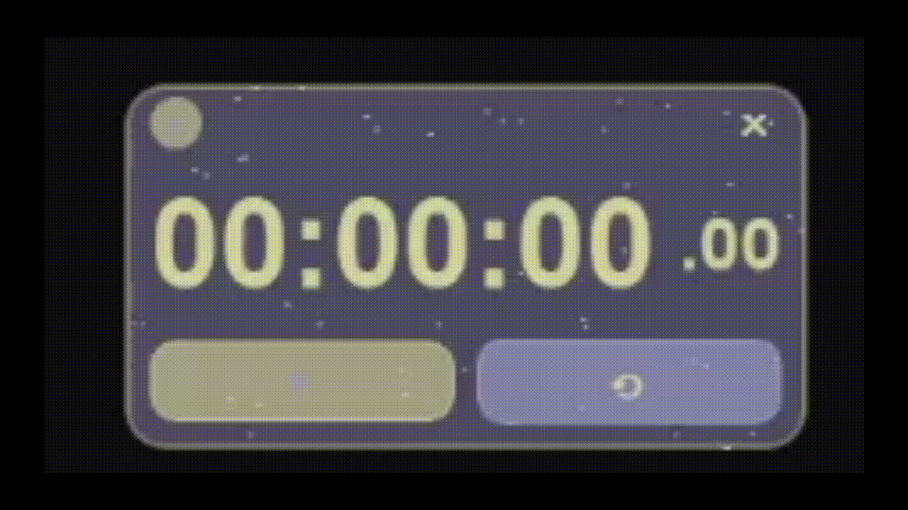

# NekoToki Stopwatch ⏰✨

A simple, customizable, floating stopwatch application with a touch of cuteness (and stars!).

## Features

*   **Standard Stopwatch:** Start, pause, and reset functionality.
*   **Always on Top:** Stays visible above other windows.
*   **Frameless & Draggable:** Clean look, click and drag anywhere on the window (except controls) to move.
*   **Resizable:** Resize from the edges and corners.
*   **Custom Background:**
    *   Click the '+' button to show background controls.
    *   Double-click the '🖼' button to select a custom background image (*.png, *.jpg, *.jpeg, *.bmp).
    *   Adjust the transparency of the custom image or the default background using the slider.
    *   Click "Change" to select a different image.
    *   Click "Reset" to go back to the default background.
    *   Aspect ratio lock is automatically enabled when an image is loaded (disable by hiding controls or resetting).
*   **Star Effect:** Subtle white stars float on the background.
*   **Minimal Interface:** Clean UI that gets out of your way.

## Screenshots


## Running the Application

1.  **Prerequisites:**
    *   Python 3.x
    *   PyQt5 (`pip install PyQt5`)

2.  **Clone the repository (or download the files):**
    ```bash
    # git clone <repository-url>
    # cd nekotoki
    ```

3.  **Run the main script:**
    ```bash
    python main.py
    ```

## File Structure

*   `main.py`: Main application entry point, sets up QApplication and global styles, runs the UI.
*   `stopwatch_ui.py`: Contains the main window class (`NekoToki`) and the custom background widget (`BackgroundWidget`), handling all UI elements, layouts, and user interactions (drag, resize, button clicks).
*   `stopwatch_core.py`: Contains the core stopwatch logic (`StopwatchCore`), managing time counting, start/pause/reset states, and signals.
*   `README.md`: This file.

